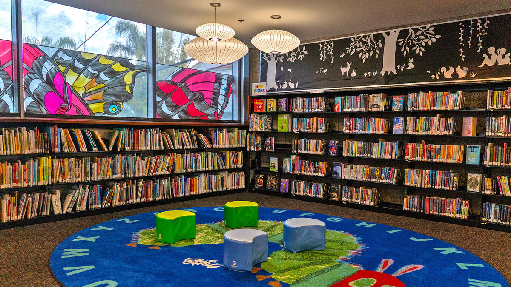

The teacher is adding books to the list, students will check books in and out. The purpose is to keep track of which books are available from the classroom library.

Tools Used: HTML CSS JS MongoDb Express Node.js

